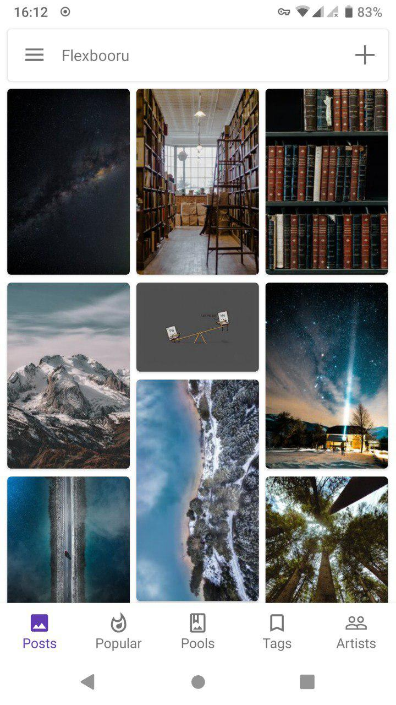
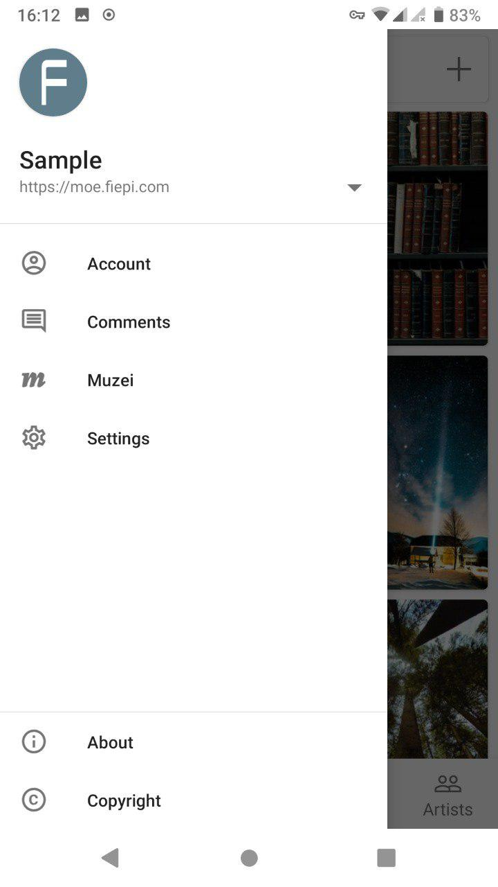
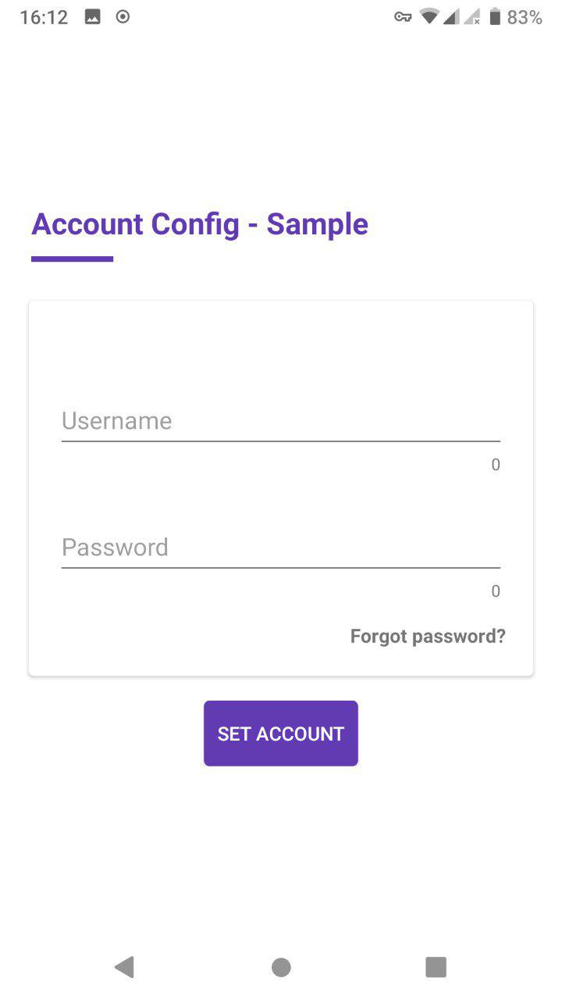

# Flexbooru
A booru client for Android, support [Danbooru](https://github.com/r888888888/danbooru), [Moebooru](https://github.com/moebooru/moebooru) and Gelbooru.

## Translate
Click on this [link](https://crowdin.com/project/flexbooru) and you can translate this app into your language.

## Downlad
 or [Github Releases](https://github.com/flexbooru/flexbooru/releases)

## Screenshot
  

## Thanks to

- [OkHttp](https://github.com/square/okhttp) An HTTP+HTTP/2 client for Android and Java applications. 
- [Retrofit](https://github.com/square/retrofit) Type-safe HTTP client for Android and Java by Square.
- [Gson](https://github.com/google/gson) A Java serialization/deserialization library to convert Java Objects into JSON and back.
- [tikxml](https://github.com/Tickaroo/tikxml) Modern XML Parser for Android.
- [Glide](https://github.com/bumptech/glide) An image loading and caching library for Android focused on smooth scrolling.
- [Picasso](https://github.com/square/picasso) A powerful image downloading and caching library for Android.
- [MaterialDrawer](https://github.com/mikepenz/MaterialDrawer) A drawer with material 2 design.
- [MaterialPreference](https://github.com/RikkaW/MaterialPreference) Based on support-preference from Android Support Library, adding a lot of exciting features.
- [FlexboxLayout](https://github.com/google/flexbox-layout) A library project which brings the similar capabilities of CSS Flexible Box Layout Module to Android.
- [PhotoView](https://github.com/chrisbanes/PhotoView) Implementation of ImageView for Android that supports zooming, by various touch gestures.
- [SubsamplingScaleImageView](https://github.com/davemorrissey/subsampling-scale-image-view) Highly configurable, easily extendable deep zoom view for displaying huge images without loss of detail. Perfect for photo galleries, maps, building plans etc.
- [ExoPlayer](https://github.com/google/ExoPlayer) An application level media player for Android. 
