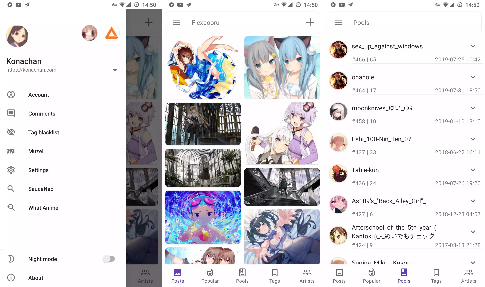

# Flexbooru
A booru client for Android, support [Danbooru](https://github.com/r888888888/danbooru), [Moebooru](https://github.com/moebooru/moebooru), Gelbooru, Shimmie, etc.

## Translate

Click the icon below to translate this app.

## Downlad

## Screenshot

## Thanks to

- [OkHttp:](https://github.com/square/okhttp) An HTTP+HTTP/2 client for Android and Java applications. 
- [Ktor:](https://github.com/ktorio/ktor) A framework for quickly creating web applications in Kotlin with minimal effort.
- [Retrofit:](https://github.com/square/retrofit) Type-safe HTTP client for Android and Java by Square.
- [KotlinxSerializationConverter:](https://github.com/JakeWharton/retrofit2-kotlinx-serialization-converter) A Retrofit 2 Converter.Factory for Kotlin serialization.
- [xmlutil:](https://github.com/pdvrieze/xmlutil) XML Serialization library for Kotlin.
- [Glide:](https://github.com/bumptech/glide) An image loading and caching library for Android focused on smooth scrolling.
- [MaterialDrawer:](https://github.com/mikepenz/MaterialDrawer) A drawer with material 2 design.
- [FlexboxLayout:](https://github.com/google/flexbox-layout) A library project which brings the similar capabilities of CSS Flexible Box Layout Module to Android.
- [PhotoView:](https://github.com/chrisbanes/PhotoView) Implementation of ImageView for Android that supports zooming, by various touch gestures.
- [SubsamplingScaleImageView:](https://github.com/davemorrissey/subsampling-scale-image-view) Highly configurable, easily extendable deep zoom view for displaying huge images without loss of detail. Perfect for photo galleries, maps, building plans etc.
- [ExoPlayer:](https://github.com/google/ExoPlayer) An application level media player for Android.
- [Kodein-DI:](https://github.com/Kodein-Framework/Kodein-DI) A very simple and yet very useful dependency retrieval container. It is very easy to use and configure.
- [Muzei:](https://github.com/romannurik/muzei) A live wallpaper that gently refreshes your home screen each day with famous works of art. It also recedes into the background, blurring and dimming artwork to keep your icons and widgets in the spotlight. Simply double touch the wallpaper or open the Muzei app to enjoy and explore the artwork in its full glory.
